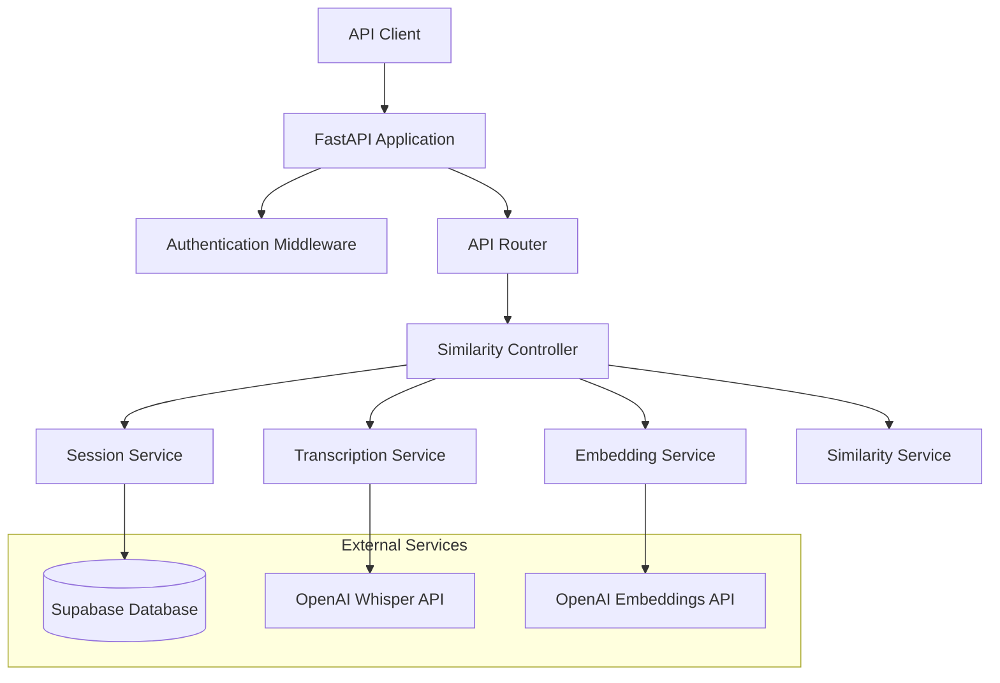
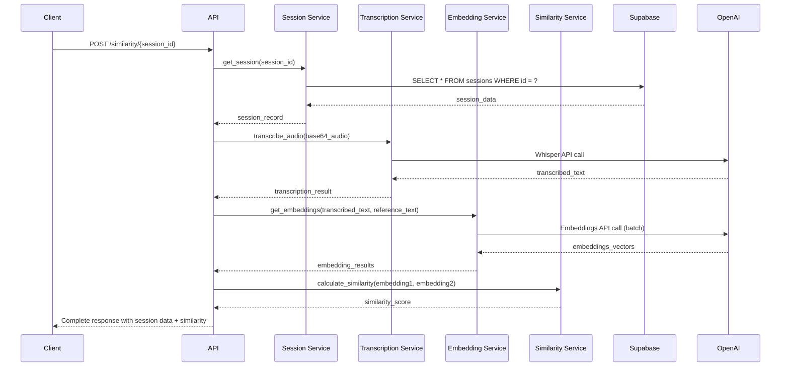

# Design Document

## Overview

The Speech Similarity API is a FastAPI-based microservice that processes audio data from a Supabase database, transcribes it using OpenAI Whisper, and calculates semantic similarity against reference documents using vector embeddings. The service follows a clean architecture pattern with proper separation of concerns, dependency injection, and comprehensive error handling.

## Architecture

### High-Level Architecture



### Request Flow



## Components and Interfaces

### 1. API Layer

**FastAPI Application Structure:**
- Main application with CORS, middleware, and error handlers
- Health check endpoints (`/health`, `/ready`)
- API versioning (`/api/v1/`)
- Automatic OpenAPI documentation

**Router Endpoints:**
```python
POST /api/v1/similarity/{session_id}
PUT /api/v1/sessions/{session_id}/audio
GET /api/v1/health
GET /api/v1/ready
```

### 2. Service Layer

**Session Service:**
- Handles database operations for session retrieval and updates
- Validates session existence and data integrity
- Updates audio data for existing sessions
- Manages Supabase connection pooling

**Transcription Service:**
- Converts base64 audio to temporary files
- Interfaces with OpenAI Whisper API
- Handles audio format validation and conversion

**Embedding Service:**
- Generates text embeddings using OpenAI's text-embedding-ada-002
- Supports batch processing for efficiency
- Caches embeddings for reference documents

**Similarity Service:**
- Calculates cosine similarity between embedding vectors
- Normalizes similarity scores to 0-1 range
- Provides similarity interpretation metadata

### 3. Data Access Layer

**Database Models:**
```python
class SessionRecord(BaseModel):
    id: int
    speech: Optional[str]
    questions: Optional[dict]  # JSONB field
    created_by: Optional[str]
    generated_by: Optional[str]
    created_at: datetime
    audio: str  # Base64 encoded audio
```

**Repository Pattern:**
- Abstract repository interface for testability
- Supabase-specific implementation
- Connection pooling and retry logic

## Data Models

### Request Models

```python
class SimilarityRequest(BaseModel):
    reference_text: str = Field(..., description="Reference document text for comparison")

class AudioUpdateRequest(BaseModel):
    audio: str = Field(..., description="Base64 encoded WAV mono audio file")
    
class SimilarityResponse(BaseModel):
    session_id: int
    session_data: SessionRecord
    transcribed_text: str
    similarity_score: float = Field(..., ge=0.0, le=1.0)
    processing_time_ms: int
    timestamp: datetime

class AudioUpdateResponse(BaseModel):
    session_id: int
    message: str
    updated_at: datetime
```

### Internal Models

```python
class TranscriptionResult(BaseModel):
    text: str
    confidence: Optional[float]
    language: Optional[str]
    
class EmbeddingResult(BaseModel):
    vector: List[float]
    model: str
    usage_tokens: int
    
class AudioData(BaseModel):
    base64_content: str
    format: str = "wav"
    channels: int = 1  # mono
```

## Error Handling

### Error Response Schema

```python
class ErrorResponse(BaseModel):
    error_code: str
    message: str
    details: Optional[dict] = None
    timestamp: datetime
    request_id: str
```

### Error Categories

1. **Client Errors (4xx):**
   - 400: Invalid request format or missing reference text
   - 404: Session ID not found
   - 422: Invalid audio data or validation errors

2. **Server Errors (5xx):**
   - 500: Internal server error
   - 502: External service unavailable (OpenAI)
   - 503: Database connection issues

3. **Custom Exception Handling:**
   - Database connection timeouts
   - OpenAI API rate limiting
   - Audio processing failures
   - Invalid base64 decoding

## Configuration Management

### Environment Variables

```python
class Settings(BaseSettings):
    # Database
    supabase_url: str
    supabase_key: str
    
    # OpenAI
    openai_api_key: str
    openai_organization: Optional[str] = None
    
    # Application
    app_name: str = "Speech Similarity API"
    app_version: str = "1.0.0"
    debug: bool = False
    
    # Performance
    max_audio_size_mb: int = 25
    request_timeout_seconds: int = 300
    
    class Config:
        env_file = ".env"
```

### Security Considerations

- Environment variables for all sensitive data
- No credentials in logs or error messages
- HTTPS enforcement for production
- Request rate limiting
- Input validation and sanitization
- Secure temporary file handling for audio processing

## Testing Strategy

### Unit Testing
- Service layer components with mocked dependencies
- Data model validation and serialization
- Utility functions (similarity calculations, audio processing)
- Error handling scenarios

### Integration Testing
- Database operations with test Supabase instance
- OpenAI API integration with test keys
- End-to-end API endpoint testing
- Error propagation through service layers

### Performance Testing
- Audio processing with various file sizes
- Concurrent request handling
- Database connection pooling under load
- OpenAI API rate limit handling

### Test Data Management
- Sample audio files in multiple formats
- Mock session data with various scenarios
- Reference documents for similarity testing
- Edge cases (corrupted audio, empty sessions)

## Deployment Considerations

### Dependencies
- FastAPI with Uvicorn ASGI server
- Supabase Python client
- OpenAI Python SDK
- Audio processing libraries (pydub, ffmpeg)
- Vector computation libraries (numpy, scipy)

### Infrastructure Requirements
- Python 3.9+ runtime environment
- Temporary storage for audio file processing
- Network access to Supabase and OpenAI APIs
- Environment variable management system
- Logging and monitoring integration

### Monitoring and Observability
- Structured logging with correlation IDs
- Performance metrics (response times, throughput)
- Error rate monitoring by category
- External service dependency health checks
- Resource utilization tracking (CPU, memory, storage)